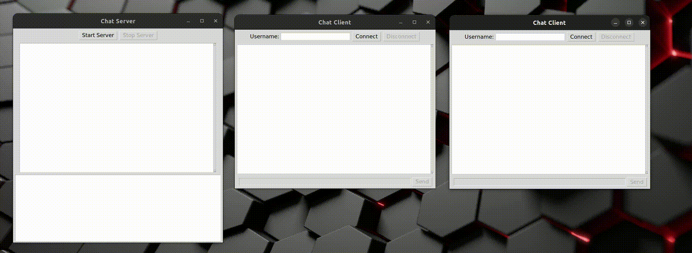

# Socket ـ Messenger

A simple messenger application built using socket programming in Python. This project demonstrates how sockets can be used to implement a basic chat system between a client and a server over a network.

## Features

- Real-time messaging between clients
- Server that handles multiple clients using multithreading
- Basic command-line interface for sending/receiving messages
- Simple and clear socket communication using TCP
- Cross-platform (Windows/Linux)

## Project Structure
```bash
.
├── client.py     # Code for client-side chat interface
├── server.py     # Code for handling multiple clients and message broadcasting
└── README.md     # Project documentation
```
## Technologies Used

- Python 3
- `socket` module
- `threading` module

## Getting Started (Windows/Linux)

### Prerequisites

Make sure you have Python 3 installed. You can check it with:

```bash
python3 --version
```
### for running the messenger:
```bash
git clone https://github.com/HoomanMoradnia/Socket_messenger.git
cd Socket_messenger
```
Running the Server:
```bash
python3 server.py
```
Running the Client (In a new terminal):
```bash
python3 client.py
```
### Help
You can type ‍‍‍```/help``` to learn about a specific command.

### Acknowledgements
This project was developed as part of a university assignment to understand the fundamentals of socket programming.

### Preview


